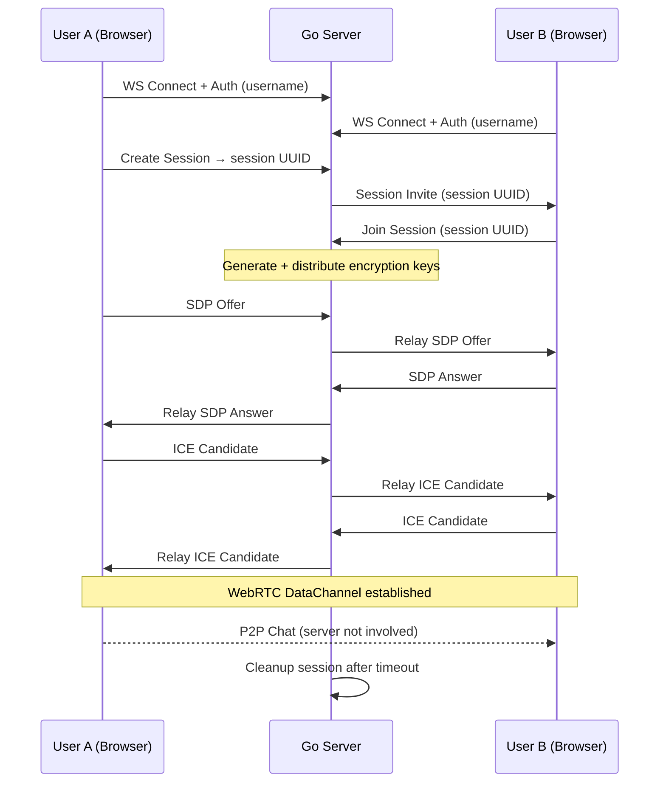

# Lowkey — Go Signaling Backend

A minimal, high-performance Go backend for a P2P chat app. Its sole responsibility is **WebRTC signaling** — brokering the initial connection between two peers — then stepping aside. All chat data flows directly between clients over WebRTC DataChannels.

## Architecture Overview



## Core Design Principles

1. **Minimal footprint** — The server only handles signaling. No message storage, no chat history.
2. **WebSocket-based signaling** — Persistent connections for real-time SDP/ICE relay.
3. **Session-scoped** — Each P2P connection gets a UUID-identified session with encryption keys.
4. **Stateless-ready** — In-memory session store by default, pluggable to Redis for horizontal scaling.
5. **Clean shutdown** — Graceful handling of OS signals and connection draining.

---

## Project Structure

```
lowkey/
├── cmd/
│   └── server/
│       └── main.go              # Entrypoint: config, DI, server start
├── internal/
│   ├── config/
│   │   └── config.go            # Env-based configuration (port, timeouts, CORS origins)
│   ├── session/
│   │   ├── session.go           # Session model (UUID, usernames, keys, timestamps)
│   │   ├── store.go             # SessionStore interface
│   │   └── memory_store.go      # In-memory implementation with TTL cleanup
│   ├── signaling/
│   │   ├── hub.go               # Connection registry: maps username → *websocket.Conn
│   │   ├── handler.go           # WebSocket upgrade + message dispatch
│   │   └── messages.go          # Message type definitions (offer, answer, ice, session-*)
│   └── crypto/
│       └── keys.go              # Key generation (X25519 key pairs for session encryption)
├── go.mod
└── go.sum
```

---

## Proposed Changes

### 1. Project Initialization

#### [NEW] [go.mod](file:///home/ayush/Documents/projects/lowkey/go.mod)
- Module: `github.com/ayush/lowkey`
- Go version: `1.23+`
- Dependencies:
  - `github.com/coder/websocket` — modern, minimal WebSocket library (stdlib-compatible)
  - `github.com/google/uuid` — session ID generation

> [!NOTE]
> Using `coder/websocket` (formerly `nhooyr/websocket`) over Gorilla because it's actively maintained, has a smaller API surface, and uses `net/http` handlers natively — no custom upgrader needed.

---

### 2. Configuration

#### [NEW] [config.go](file:///home/ayush/Documents/projects/lowkey/internal/config/config.go)
- Load from environment variables with sensible defaults:
  - `PORT` (default `8080`)
  - `SESSION_TTL` (default `10m` — auto-cleanup stale sessions)
  - `CORS_ORIGINS` (comma-separated allowed origins)
  - `KEY_SIZE` (default `32` bytes for X25519)
- Single `Config` struct, loaded once at startup

---

### 3. Session Management

#### [NEW] [session.go](file:///home/ayush/Documents/projects/lowkey/internal/session/session.go)

```go
type Session struct {
    ID        uuid.UUID
    Users     [2]string   // exactly 2 usernames per session
    SharedKey []byte      // symmetric key for E2E encryption
    CreatedAt time.Time
    ExpiresAt time.Time
}
```

#### [NEW] [store.go](file:///home/ayush/Documents/projects/lowkey/internal/session/store.go)

```go
type Store interface {
    Create(creator string) (*Session, error)
    Join(sessionID uuid.UUID, joiner string) (*Session, error)
    Get(sessionID uuid.UUID) (*Session, error)
    Delete(sessionID uuid.UUID) error
}
```

#### [NEW] [memory_store.go](file:///home/ayush/Documents/projects/lowkey/internal/session/memory_store.go)
- `sync.RWMutex`-guarded `map[uuid.UUID]*Session`
- Background goroutine that sweeps expired sessions every `SESSION_TTL / 2`
- `Join()` validates: session exists, not full, user isn't already in it

---

### 4. Signaling Hub & WebSocket Handler

#### [NEW] [hub.go](file:///home/ayush/Documents/projects/lowkey/internal/signaling/hub.go)

The hub tracks online users and routes messages:

```go
type Hub struct {
    mu    sync.RWMutex
    conns map[string]*websocket.Conn  // username → connection
    store session.Store
}
```

- `Register(username, conn)` — adds a user
- `Unregister(username)` — removes on disconnect
- `Send(username, msg)` — writes JSON to the target user's WebSocket
- Thread-safe with `sync.RWMutex`

#### [NEW] [handler.go](file:///home/ayush/Documents/projects/lowkey/internal/signaling/handler.go)

Single HTTP handler: `GET /ws?username=<name>`

1. Upgrade to WebSocket via `websocket.Accept()`
2. Register connection in Hub
3. Read loop: decode incoming JSON messages, dispatch by `type` field:
   - `session:create` → create session, notify creator with UUID + keys
   - `session:join` → join session, send keys to joiner, notify creator
   - `signal:offer` → relay SDP offer to peer
   - `signal:answer` → relay SDP answer to peer
   - `signal:ice` → relay ICE candidate to peer
4. On disconnect: unregister, cleanup any active sessions

#### [NEW] [messages.go](file:///home/ayush/Documents/projects/lowkey/internal/signaling/messages.go)

```go
type Message struct {
    Type      string          `json:"type"`
    SessionID string          `json:"sessionId,omitempty"`
    Target    string          `json:"target,omitempty"`
    Payload   json.RawMessage `json:"payload,omitempty"`
}
```

Message types:
| Type | Direction | Purpose |
|------|-----------|---------|
| `session:create` | Client → Server | Create a new session |
| `session:created` | Server → Client | Session UUID + encryption key |
| `session:join` | Client → Server | Join existing session by UUID |
| `session:joined` | Server → Both | Session ready, keys distributed |
| `signal:offer` | Client → Server → Client | SDP offer relay |
| `signal:answer` | Client → Server → Client | SDP answer relay |
| `signal:ice` | Client → Server → Client | ICE candidate relay |
| `error` | Server → Client | Error message |

---

### 5. Encryption Key Management

#### [NEW] [keys.go](file:///home/ayush/Documents/projects/lowkey/internal/crypto/keys.go)

- `GenerateSessionKey() ([]byte, error)` — generates a 32-byte random symmetric key using `crypto/rand`
- This key is distributed to both peers during session setup
- Peers use this key to encrypt/decrypt DataChannel messages client-side (AES-256-GCM)

> [!IMPORTANT]
> The server generates and distributes the key but **never sees the chat content**. The key is only used by the frontend for E2E encryption over the DataChannel.

---

### 6. Server Entrypoint

#### [NEW] [main.go](file:///home/ayush/Documents/projects/lowkey/cmd/server/main.go)

```go
func main() {
    cfg := config.Load()
    store := session.NewMemoryStore(cfg.SessionTTL)
    hub := signaling.NewHub(store)

    mux := http.NewServeMux()
    mux.HandleFunc("/ws", hub.HandleWebSocket)
    mux.HandleFunc("/health", healthCheck)

    srv := &http.Server{
        Addr:         ":" + cfg.Port,
        Handler:      corsMiddleware(mux, cfg.CORSOrigins),
        ReadTimeout:  15 * time.Second,
        WriteTimeout: 15 * time.Second,
    }

    // Graceful shutdown on SIGINT/SIGTERM
    go gracefulShutdown(srv)
    log.Printf("Lowkey server listening on :%s", cfg.Port)
    srv.ListenAndServe()
}
```

- CORS middleware (simple, inline — no dependency needed)
- `/health` endpoint for liveness probes
- Graceful shutdown with `context.WithTimeout`

---

## Verification Plan

### Automated Tests

All tests runnable via:
```bash
cd /home/ayush/Documents/projects/lowkey && go test ./... -v -race
```

| Package | What's Tested |
|---------|--------------|
| `session` | Create/Join/Get/Delete, TTL expiry, duplicate-join prevention, full-session rejection |
| `signaling` | Message serialization/deserialization, hub register/unregister, message routing |
| `crypto` | Key generation length, randomness (no two keys equal) |
| `config` | Env var parsing, defaults |

#### Integration test (WebSocket end-to-end)
- Spin up an `httptest.Server` with the real handler
- Two WebSocket clients simulate User A and User B
- Full flow: connect → create session → join → exchange offer/answer/ICE → verify relay
- Run with: `go test ./internal/signaling/ -v -race -run TestSignalingFlow`

### Manual Verification
- Start the server locally with `go run ./cmd/server/`
- Connect two browser tabs via a minimal HTML page that opens WebSockets
- Verify session creation, joining, and SDP/ICE relay in browser DevTools Network tab
- Confirm the server logs show register/unregister/relay events

> [!TIP]
> After the backend is verified, the frontend (React Native) connects to `ws://localhost:8080/ws?username=<name>` and uses the signaling messages to establish WebRTC connections.
