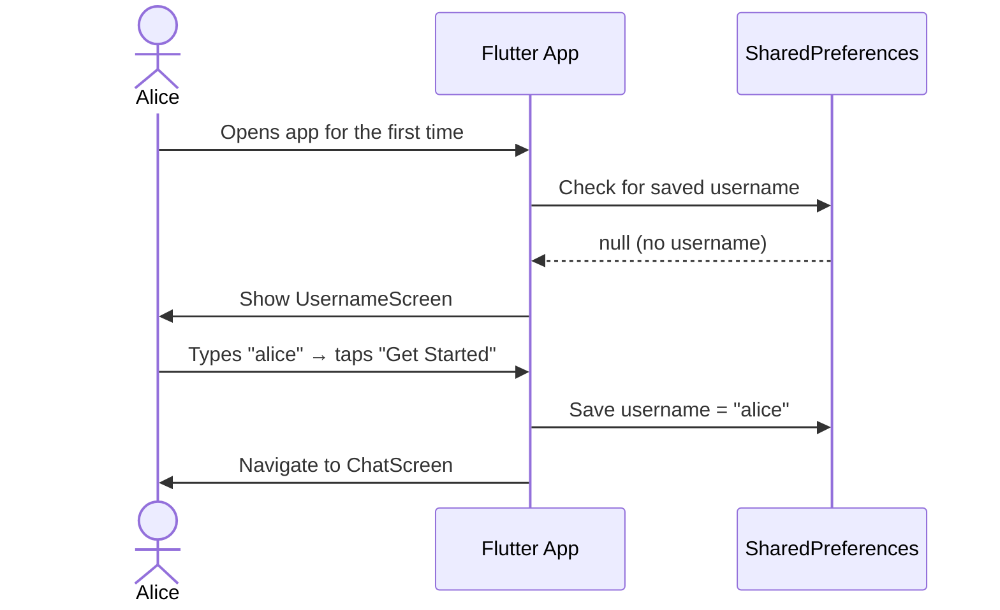
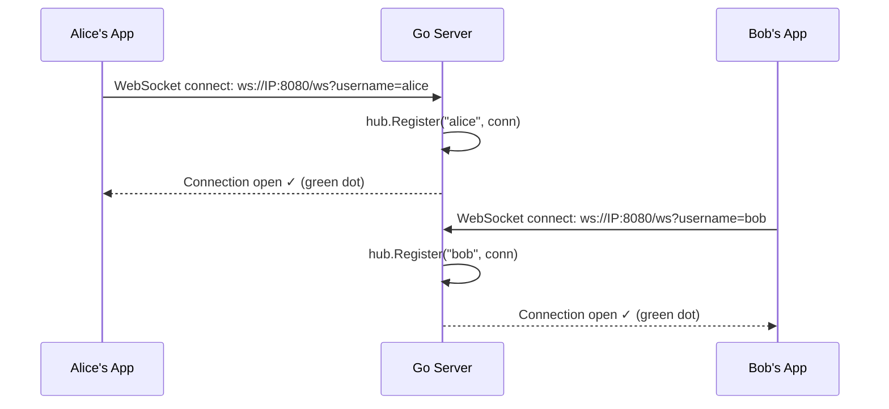
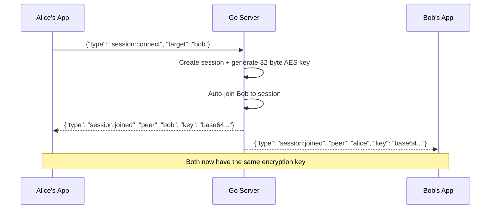
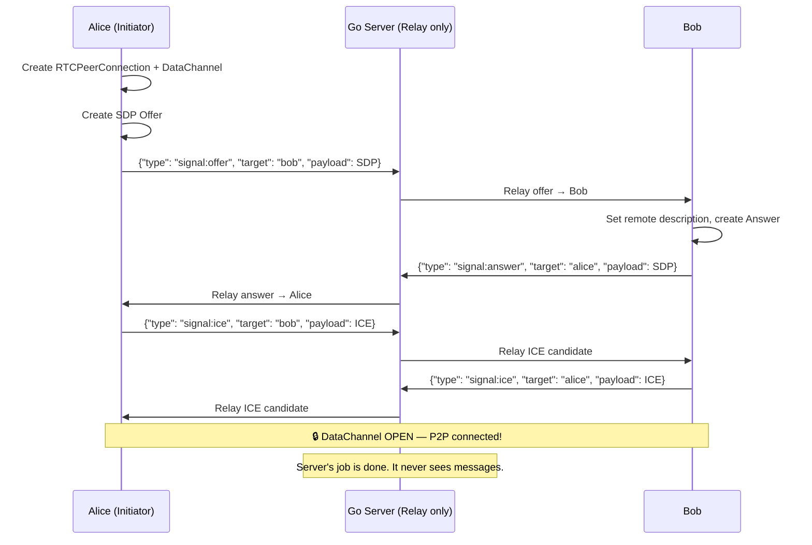
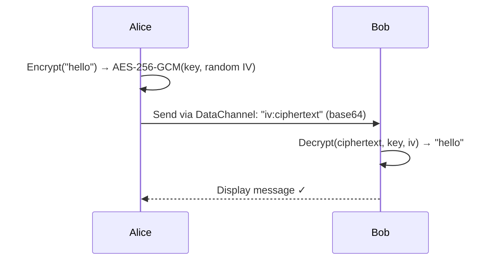

# Lowkey v1 — Architecture & Flow

## Overview

Lowkey is a peer-to-peer encrypted chat app. The server's only job is matchmaking — once two users are connected, all messages flow **directly between their phones** via WebRTC, encrypted with AES-256-GCM.

```
┌──────────┐         ┌──────────────┐         ┌──────────┐
│ Phone A  │◄──P2P──►│  Go Server   │◄──WS───►│ Phone B  │
│ (Alice)  │  WebRTC │  (Signaling) │  WebSocket│  (Bob)   │
└──────────┘         └──────────────┘         └──────────┘
     ▲                                              ▲
     └──────── Direct DataChannel (E2E) ────────────┘
```

> [!NOTE]
> After the WebRTC connection is established, the server is no longer involved in message delivery.

---

## Complete User Flow

### Phase 1: Username Setup



### Phase 2: Server Connection



### Phase 3: Connect by Username



### Phase 4: WebRTC P2P Connection



### Phase 5: Encrypted Chat



---

## Component Map

| Layer | Component | Tech | Role |
|:------|:----------|:-----|:-----|
| **Backend** | [cmd/server/main.go](file:///home/ayush/Documents/projects/lowkey/cmd/server/main.go) | Go | HTTP server, routing |
| | [internal/signaling/hub.go](file:///home/ayush/Documents/projects/lowkey/internal/signaling/hub.go) | Go | WebSocket connection registry |
| | [internal/signaling/handler.go](file:///home/ayush/Documents/projects/lowkey/internal/signaling/handler.go) | Go | Message dispatch + session:connect |
| | [internal/session/store.go](file:///home/ayush/Documents/projects/lowkey/internal/session/store.go) | Go | Session lifecycle + key generation |
| | [internal/crypto/keys.go](file:///home/ayush/Documents/projects/lowkey/internal/crypto/keys.go) | Go | X25519 key pair generation |
| **Frontend** | [SignalingService](file:///home/ayush/Documents/projects/lowkey/app/lib/services/signaling_service.dart#6-142) | Dart | WebSocket client for server comms |
| | [WebRTCService](file:///home/ayush/Documents/projects/lowkey/app/lib/services/webrtc_service.dart#6-147) | Dart | Peer connection + DataChannel |
| | [CryptoService](file:///home/ayush/Documents/projects/lowkey/app/lib/services/crypto_service.dart#6-50) | Dart | AES-256-GCM encrypt/decrypt |
| | [UsernameScreen](file:///home/ayush/Documents/projects/lowkey/app/lib/screens/username_screen.dart#5-11) | Flutter | Username input + persistence |
| | [ChatScreen](file:///home/ayush/Documents/projects/lowkey/app/lib/screens/chat_screen.dart#13-19) | Flutter | Connect panel + message UI |

---

## Crypto Details (v1)

| Property | Value |
|:---------|:------|
| **Symmetric Cipher** | AES-256-GCM |
| **Key Size** | 32 bytes (256 bits) |
| **IV/Nonce** | 12 bytes, random per message |
| **Key Generation** | Server-side via Go `crypto/rand` |
| **Key Distribution** | Server → both peers over WebSocket |
| **Message Format** | `base64(IV) + ":" + base64(ciphertext + GCM tag)` |

## Known Limitation

> [!CAUTION]
> **Trust-the-server model**: The server generates and distributes the encryption key. A compromised server could retain the key. v2 will use **client-side X25519 Diffie-Hellman** (libsodium) so the server never sees the shared secret.
