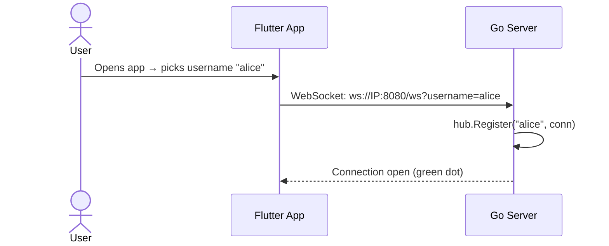
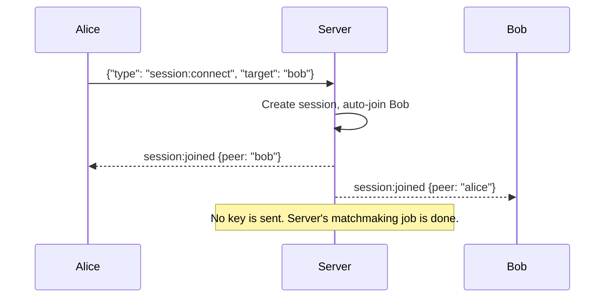
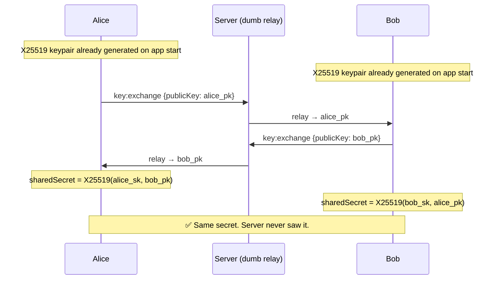
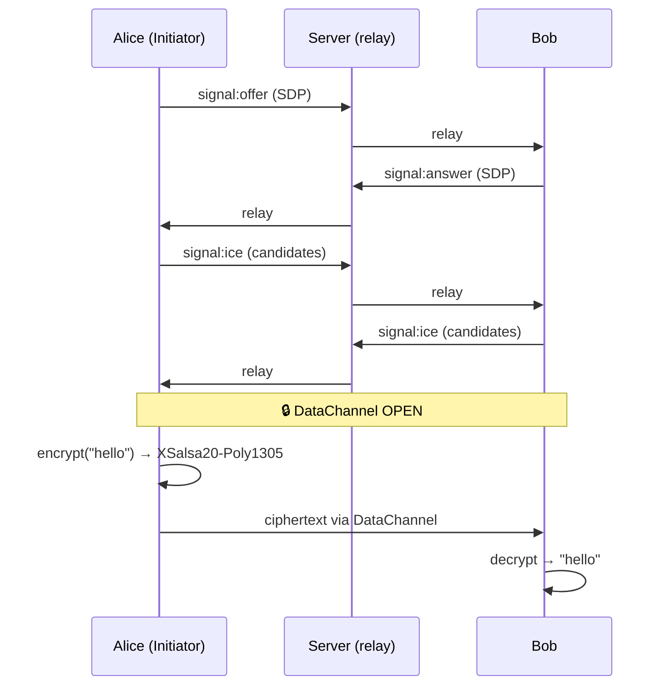
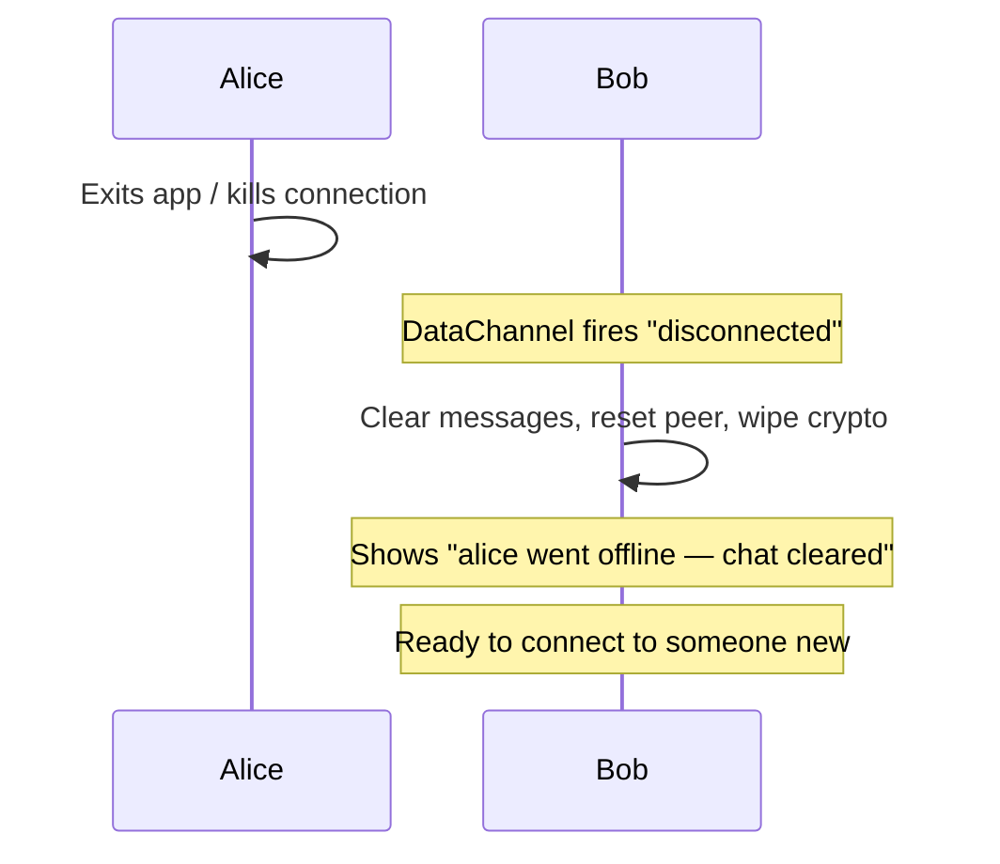

# Lowkey v2 — Zero-Trust E2E Architecture

## Overview

Lowkey is a peer-to-peer encrypted chat app. Messages flow **directly between phones** via WebRTC — the server only brokers connections and relays public keys. It **never sees** the encryption key.

```
┌──────────┐                                    ┌──────────┐
│ Phone A  │◄───── WebRTC DataChannel ─────────►│ Phone B  │
│ (Alice)  │   XSalsa20-Poly1305 encrypted      │  (Bob)   │
└────┬─────┘                                    └────┬─────┘
     │  WebSocket                          WebSocket │
     └──────────────► Go Server ◄────────────────────┘
                   (relay only)
```

---

## User Flow

### Phase 1: Username → Server Connection



### Phase 2: Connect by Username



### Phase 3: Client-Side Key Exchange (X25519)



### Phase 4: WebRTC P2P + Encrypted Chat



### Phase 5: Peer Disconnect



---

## Crypto Stack

| Property | Value |
|:---------|:------|
| **Key Exchange** | X25519 Diffie-Hellman |
| **Symmetric Cipher** | XSalsa20-Poly1305 (NaCl SecretBox) |
| **Nonce** | 24 bytes, random per message |
| **Library (Dart)** | `pinenacl` (pure Dart NaCl) |
| **Key Trust** | Zero-trust — server never sees shared secret |

## Component Map

| Component | File | Role |
|:----------|:-----|:-----|
| Server entry | `cmd/server/main.go` | HTTP + WebSocket server |
| Connection hub | `internal/signaling/hub.go` | Username → WebSocket registry |
| Message handler | `internal/signaling/handler.go` | Dispatch + relay (no crypto) |
| Session store | `internal/session/memory_store.go` | Session lifecycle (no keys) |
| Signaling client | `app/lib/services/signaling_service.dart` | WebSocket + key:exchange |
| Crypto service | `app/lib/services/crypto_service.dart` | X25519 + SecretBox |
| WebRTC service | `app/lib/services/webrtc_service.dart` | P2P DataChannel |
| Chat UI | `app/lib/screens/chat_screen.dart` | Connection panel + messages |

## What Changed from v1

| | v1 | v2 |
|:---|:---|:---|
| **Key generation** | Server-side | Client-side (X25519) |
| **Key distribution** | Server sends key to both | Peers exchange public keys |
| **Server trust** | Must trust server | Zero-trust |
| **Cipher** | AES-256-GCM | XSalsa20-Poly1305 |
| **Library** | `encrypt` (PointyCastle) | `pinenacl` (NaCl) |
| **Disconnect** | Stale chat persists | Chat cleared, state reset |
